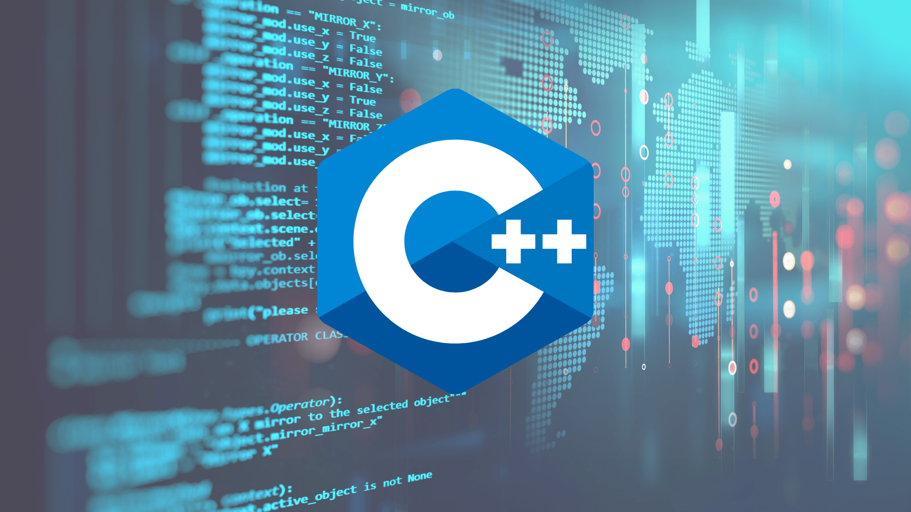

 <h1 align="center">Projects of CS </h1>

  

    An awesome README template to jumpstart your projects!
     
    <a href="https://developer.mozilla.org/en-US/docs/Web/JavaScript"><strong>Explore the MDN docs »</strong></a>
     
    
  

<!-- TABLE OF CONTENTS -->

  
Table of Contents

  <ul>
    <li><a href="#about-the-repository">About The Repository</a></li>
    <li><a href="#focp-esp">FOCP ESP - Game</a></li>
    <li><a href="#tic-tac-toe">Tic Tac Toe Game</a></li>
  </ul>

<!-- ABOUT THE REPO -->

## About The Repository

This Repostory basically consists of My End Semester projects of Computer Science and also some of the projects I do by my self.

<!-- PROJECT LOGO -->
 

  

                                                                         
                                                                        
(<a href="#top">back to top</a>)

                                                                                                        
                                                                        

                                                                        
                                                                        
